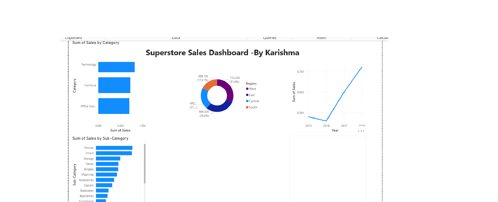

# 📊 Sales Dashboard — Python + Power BI

An end-to-end data analysis project using Python (Google Colab) 
for data cleaning & visualization, and Power BI for interactive dashboard.

## 🔗 Live Dashboard

## 📁 Dataset
- **Source:** Superstore Sales Dataset (Kaggle)
- **Size:** 9,000+ rows | 18 columns
- **Fields:** Order Date, Category, Sub-Category, Region, Sales, Segment

## 🛠️ Tools Used
- Python (Google Colab) — Pandas, Matplotlib
- Microsoft Power BI Desktop
- GitHub

## 📈 Key Insights
- 🏆 **Technology** is the highest selling category ($830K+)
- 🌍 **West region** leads all regions in sales
- 📱 **Phones & Chairs** are top sub-categories
- 📅 Sales peak towards **end of year**

## 🔍 Python Analysis (Google Colab)
- Loaded & cleaned 9,000+ row dataset
- Handled date formatting and added Year/Month columns
- Generated 4 charts: Category, Region, Monthly Trend, Sub-Category

## 📊 Power BI Dashboard
- Sales by Category (Bar Chart)
- Sales by Region (Donut Chart)
- Sales Trend by Year (Line Chart)
- Top Sub-Categories by Sales (Bar Chart)

## 👩‍💻 Author
**Karishma** — BCA 2nd Year, Galgotias University
🌐 [Portfolio](https://kk-create27.github.io) | 
📁 [GitHub](https://github.com/kk-create27)
